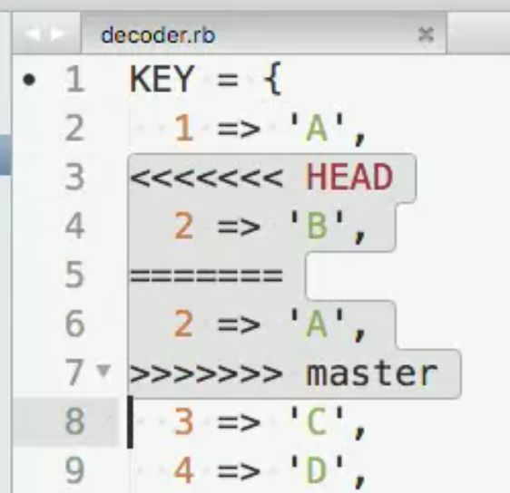

# Git Cheat Sheet

This document is a cheat sheet I created for myself but perhaps it will be useful to others. I will continue to work on it as I learn more about Git. If you see mistakes or have suggestions, please feel free to contact me at masood@masoodkamandy.com.

## Getting Started

You have to set your username and email address before being able to use git.

`git config --global user.name "Your Name"`

`git config --global user.email "youremail@yourdomain.com"`

To confirm that these are set run:

`git config --list`

## Basic Process to Follow When a File has Changed

1. Stage the file with `git add <file>`
2. Commit the file with a message with `git commit -m <message>`

Note: It is **not advised** to make commits to the main branch. If you want to create a new branch before you stage and commit, add this before step 1 above:

`git checkout -b <branch-name>`

## Basic Git Commands

`git init` – Initialize git in current directory

Note: If you are using GitHub, after you create a local repository, if it is local it may not adhere to GitHub's new nomenclature. To change master to main, after you make your first commit, type the following: `git branch -m master main` and this will change the name of your primary branch to main from the older master.

`git status` – Check status of git repository

`git add` – Stage a file for version tracking.

`git commit -m “Message”` – Commit a file to the “main” branch.

`git diff` – Show changes.

`git diff --staged` –  Show changes that include staged changes.

`git log` – See all changes listed.

`git log -p` – See all changes listed including actual changes to files.

`git clone <URL>` – clone a repository to your current folder.

## Intermediate Git Commands

`git rm <file name>` – Delete a file and include the change in the git repository. You must commit these changes.

`git mv <file name>` – Change a file’s name

`git checkout -- <file name>` ­– discard changes (including accidental deletion).

`git revert <SHA checksum>` – revert a specific commit

`git revert HEAD` – revert most recent commit

`git remote` – get a list of the remote repos.

`git pull <repo name>` – pull changes from remote repo. If you don’t specify a repo name, it just pulls from the origin.

`git pull <repo name> <branch name>` – pull from a specific branch. This is required if you add a remote that wasn’t there. If it’s origin, it will work without a branch name.

`git remote` – See which remotes are connected to your current repo. This only shows up if your project is cloned. If it isn’t, you’ll need to add a remot (see below).

`git remote add <name of remote repo> <url of remote repository>` - add a remote repo if it isn’t already there like the origin.

`git push` – share changes you’ve made with others.

`git push -u <repo name> <branch. Default is main>` – the push process for GitHub after you’ve specified a remote repo. (u is for upstream). Once you do this, you can just type git push by itself.

**Note:** If you started your reposotory on your computer and then began pushing to a remote afterward, it will be necessary to set your default remote repository so that you can just type `git push` and have it go to your remote. To do this, after you have a remote repository set up, type `git config --global push.default current`.

It might also be necessary to remove files if you've updated your gitignore file. To remove cached files from your git use `git rm --cached file1` and to remove cached directories, you need to do it recursively so use `git rm --cached -r folder1`.

## Branching/Branches

**Notes:**

- When you have a specific task (like fixing a bug) that you want to work on that is not ready for your users, **create a branch and work on that instead of main**.
- If you are going to merge into the main branch, **always branch from the main**.

`git branch <name-of-branch>` – create a new branch. Name should be all lower case and words should be separated by dashes.

`git branch` – shows you a list of branches and the active branch has a * next to it.

`git checkout <name-of-branch>` – switch to another branch.

`git checkout -b <name-of-new-branch>` – create a new branch and then check it out.

`git branch -d <branch-name>` – delete branch.

`git branch -a` – get a list of all branches, including all remote branches.

### Comparing Branches

`git diff <SHA Checksum of earlier commit> <SHA Checksum of later commit>` – Compare two different commits.

`git diff <name of branch> <name of branch>` – compare two branches.

`git diff <name of branch>` – compare current working directory with branch.

## Merging

**Notes:**

- Most commonly used to merge topic branches into the main branch.
- It’s a good idea to delete branches after you test them completely and merge them into the main so they don’t confuse you in the future.

`git merge <branch-name>` – merges whatever branch you specify into the current branch.

### Merge Conflicts

**Notes:**

- When a file has conflicts, it will add conflict resolution markers to the file:
   
- You can just fix the changes and then remove the conflict resolution markers.
- If you’re unsure of what to do, just type git status. 

`git merge --abort` – Use when you have a merge conflict that you cannot resolve, so you want to abort the merge process.

`git add <file>` – marks that the file has been resolved when there is a conflict.

## Remote Branches

`git fetch <name of remote repo>` – used to fetch changes from the remote branch so that you can check whether you are out of sync. Once you run this, type `git status` to see if you are out of sync or up to date.

`git merge <remote repo>` – merges changes from remote repo.

`git checkout -b <name of new branch> <name of remote branch to track it to>` – this is how you create a tracking/local branch for a remote branch. See next:

`git checkout --track <name of remote branch to create/track>` – do above but duplicate the name of the remote branch.

**Note:** You can also just type `git checkout <name of remote branch>` and git will automatically set up a local/tracking branch to track the remote of the same name.

`git pull` – retrieve and merge remote changes and incorporate them into your local tracking branch.

`git push -u <remote repo> <remote-branch>` – push your changes and set up the local branch to track the remote branch. -u stands for upstream. After doing this, you’ll only have to type `git push` because the local branch will be a tracking branch.

`git push --delete <remote-branch-to-delete>` – allows you to delete a remote branch. You should do this after merging.

## Vocabulary

**SHA Checksum** – Simple Hashing Algorithm

Note: Every commit creates an SHA that is a unique identifier for every commit. If you need to revert to a specific commit you can use this checksum to identify which commit you want.

**HEAD** – Shorthand for “Most recent commit”

**Local Repo** – The repo on **your** machine.

**Remote Repo** – The repos on **other people’s** machines that are linked to your project. origin is automatically added as the repo you’ve cloned from.

**Central Repo** – A centralized “main” repo that developers work from (like GitHub repos).

**Pulling commits** – Pull the changes other developers have made directly from their computers or from the central repo to their repos so you have latest version of code.

**Pushing commits** – Push changes to the central repo.

**Clone** – Make a copy of a repo.

**Detached HEAD** – Happens when you checkout a specific commit using an SHA checksum as opposed to a branch. You can lose data with a detached HEAD so it’s not recommended to checkout specific commits.

**Tracking Branch** – A branch that is designed to track changes to remote branches.

## Basic Unix Command Refresher 

`ls -a` – Show files including hidden files.

`cd ..` – Go up a directory

`cd ../<directory>` – Go to the parent and then a different subdirectory in that.

`clear` – clear terminal

**Ctrl + L** – clear terminal

`cat` – look at file’s contents.

 
